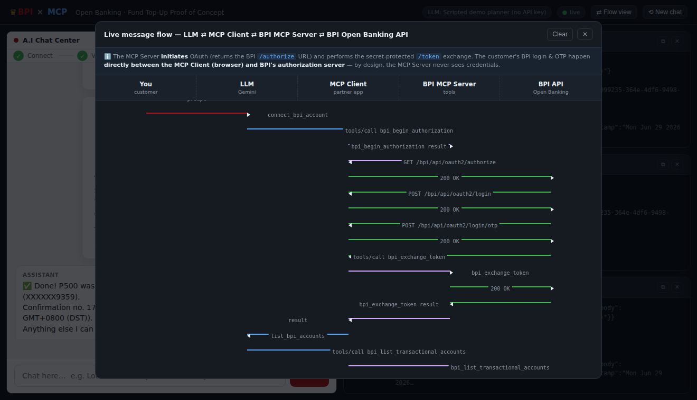

# BPI × MCP — Open Banking Fund Top-Up Proof of Concept

A self-contained proof of concept that **visualises the interactions between an
LLM, an MCP Client, the (proposed) BPI MCP Server, and the BPI Open Banking
API** — all on one screen.

It implements the **Standard Fund Top-Up** journey from the *BPI PARTNER API 2.0
— API Contract v2.1.6*: 3‑Legged OAuth (login → OTP → consent), transactional
account retrieval, and `initiate → otp → process` with a transaction OTP.


## The four screens

The UI is split exactly like the proposed wireframe:

| Panel | What it shows |
|-------|---------------|
| **A.I Chat Center** | A normal AI chat app (powered by Google **Gemini**) that can call tools on an MCP server. The BPI **login**, **login OTP**, **account selection**, and **transaction OTP** screens are simulated *inside* the chat, plus a success receipt. |
| **MCP Client Terminal** | The partner app acting as the **MCP client** — the JSON‑RPC `tools/call` requests and results exchanged with the BPI MCP Server over stdio. |
| **BPI MCP Server Terminal** | The **BPI MCP Server** receiving tool calls and translating them into authenticated HTTP calls to the Open Banking API. |
| **BPI Open Banking API Server Terminal** | The actual simulated **HTTP request/response** traffic for every Open Banking endpoint, shaped per the API contract. |

## Demo & UI features

Built for live presentation and for inspecting exactly what flows between the layers:

* **Journey stepper** — *Connect → Verify → Choose account → Confirm → Done* lights up above the chat as the customer progresses.
* **Tool-call chips** — when the LLM invokes a tool, an inline chip shows it running, then ✓ with the round-trip duration.
* **Per-panel status + latency badges** — each terminal header shows a health dot and rolling latency (last · average ms).
* **Request inspector** — click any terminal line to open a drawer with the full source, event, latency, timestamp, and pretty-printed payload.
* **Live sequence diagram** — the **⇄ Flow view** button opens an animated You → LLM → MCP Client → BPI MCP Server → BPI API sequence diagram, drawn from the same event stream.
* **Terminal tools** — copy / clear per panel; pacing (`PACE_MS`, `BPI_API_LATENCY_MS`) so the cascade is watchable.



## Architecture

```
Browser (4 panels) ──WebSocket──┐
                                │
  ┌─────────────────────────────▼──────────────────────────────┐
  │ Orchestrator  (server/orchestrator.js, :3000)               │
  │   • A.I Chat Center  ← Gemini LLM agent loop                │
  │   • MCP CLIENT  ──stdio JSON-RPC──►  BPI MCP Server (child) │
  │   • human-in-the-loop bridge (login / OTP / account / OTP)  │
  └───────────────┬─────────────────────────────────────────────┘
                  │ stdio (stdout=JSON-RPC, stderr=logs)
  ┌───────────────▼─────────────────────────────┐
  │ BPI MCP SERVER  (server/bpi-mcp-server.js)   │  BPI-owned, multi-tenant
  │   tools: bpi_partner_authenticate,           │  partner registry = BPI's vault
  │          bpi_begin_authorization,            │  (per-tenant Open Banking
  │          bpi_exchange_token,                 │   client_id/secret never leave)
  │          bpi_list_transactional_accounts,    │  keeps OAuth tokens server-side
  │          bpi_fundtopup_{initiate,send_otp,   │
  │                         process,status}      │
  └───────────────┬──────────────────────────────┘
                  │ HTTPS (Bearer + X-IBM-Client-Id/Secret)
  ┌───────────────▼──────────────────────────────┐
  │ Mock BPI Open Banking API (server/bpi-api.js, :4000)         │
  │   /bpi/api/oauth2/{authorize,login,login/otp,token}          │
  │   /bpi/api/accounts/transactionalAccounts                    │
  │   /bpi/api/fundTopUp/{initiate,otp,process,status}           │
  └──────────────────────────────────────────────┘
```

* **Product framing:** **BPI owns and operates the MCP Server** and offers it to
  partners as a product; the **partner** brings its own LLM + **MCP Client**. The
  client and server speak the real Model Context Protocol
  (`@modelcontextprotocol/sdk`) over stdio, as genuinely separate processes.
* **Two authentication layers:**
  1. **Partner ↔ BPI MCP Server** — the partner app authenticates *itself* with
     its **MCP‑layer credentials** (`bpi_partner_authenticate`, OAuth2
     client‑credentials). BPI's multi‑tenant **partner registry** maps the
     partner to that tenant's **BPI Open Banking `client_id`/`client_secret`**,
     held in BPI's vault. The Open Banking `client_secret` **never leaves BPI**
     and is never returned to the client — the partner only gets an opaque
     `partnerToken`. (The demo registry has two tenants — DRAGONPAY & JUANPAY —
     to make the tenant→secret mapping concrete.)
  2. **Customer ↔ BPI (3‑legged OAuth)** — see below.
* **3‑Legged OAuth, MCP‑aligned:** the **MCP Server initiates** authorization
  (`bpi_begin_authorization` returns BPI's hosted `/authorize` URL — it owns the
  `client_id`/scopes). The customer's **login + OTP happen directly between the
  MCP Client (browser) and BPI's authorization server** — the MCP Server never
  sees credentials, per the MCP authorization model. The secret‑protected
  `code → token` exchange (which needs `client_secret`) and all transactional
  calls then go **through MCP**, with the access token held server‑side so the
  LLM never handles raw bearer tokens. Open the **⇄ Flow view** to see this.
* The Open Banking API is a faithful **mock** of the contract responses — no
  real BPI systems are contacted.

## Quick start

```bash
# 1. Install dependencies
npm install

# 2. Configure (optional but recommended)
cp .env.example .env
#    then edit .env and paste your Gemini API key (see below)

# 3. Run
npm start

# 4. Open the UI
open http://localhost:3000
```

Then type, for example:

> **Load ₱500 to my wallet from my BPI account**

…and watch the LLM connect via OAuth, list your accounts, and complete the
top-up while every component narrates itself in its own terminal.

## Where do I put the Gemini API key?

1. Get a key from **https://aistudio.google.com/apikey**.
2. Copy the template: `cp .env.example .env`
3. Open **`.env`** and set:

   ```ini
   GEMINI_API_KEY=your_key_here
   # optional:
   GEMINI_MODEL=gemini-3.6-flash
   ```
4. Restart `npm start`. The top bar will show `LLM: Gemini (gemini-3.6-flash)`.

> **No key?** The PoC still runs end‑to‑end using a built‑in **offline scripted
> planner** so you can demo the full journey without any external calls. The top
> bar will say so, and a note appears in the chat. Add a key any time to switch
> to the real model.

`.env` is git‑ignored — your key is never committed.

### Setting the key in GitHub Codespaces

You have two options. **Option A is the quickest; Option B is the most secure**
(the key survives Codespace rebuilds and is never typed into a file).

**Option A — a local `.env` file (quick)**

1. Open your Codespace (GitHub repo → green **`< > Code`** button → **Codespaces**
   tab → open/create one).
2. In the Codespace **Terminal** (menu **Terminal → New Terminal**), run:
   ```bash
   cp .env.example .env
   ```
3. In the **Explorer** on the left, click the new **`.env`** file to open it.
4. Find the line `GEMINI_API_KEY=` and paste your key after the `=`:
   ```ini
   GEMINI_API_KEY=AIzaSy...your_key...
   ```
5. Save (**Ctrl/Cmd + S**), then in the terminal run `npm install` (first time
   only) and `npm start`.
6. The top bar shows `LLM: Gemini …` once the key is picked up. This `.env` stays
   in your Codespace and is never committed.

**Option B — a Codespaces secret (recommended)**

1. On GitHub, go to your profile **Settings** → **Codespaces** → **Codespaces
   secrets** → **New secret**.
   (Direct link: **https://github.com/settings/codespaces**)
2. **Name:** `GEMINI_API_KEY`  •  **Value:** your key.
3. Under **Repository access**, tick **`yuribanares/mcpserverbpipoc`**, then
   **Add secret**.
4. **Rebuild/restart** the Codespace (Command Palette → *Codespaces: Rebuild
   Container*, or stop & reopen) so the secret is injected.
5. Run `npm start` — no `.env` needed; the app reads `GEMINI_API_KEY` straight
   from the environment.

> Either way you do **not** commit the key. Only the empty template
> (`.env.example`) lives in the repo.

### Troubleshooting Gemini

* **`404 … model … is no longer available`** — Google retired that model name.
  Set a current one in `.env`, e.g. `GEMINI_MODEL=gemini-3.6-flash` (or
  `gemini-2.5-flash`), then restart `npm start`.
* **`429 RESOURCE_EXHAUSTED … limit: 0`** — your API key's Google project has **no
  free‑tier quota** for the chosen model. Either **enable billing** on the
  project (AI Studio → *Get API key* → the linked Cloud project), or set a
  different `GEMINI_MODEL` in `.env` (try `gemini-3.6-flash` or
  `gemini-2.5-flash`). The error message in chat tells you which case you hit.
* **`API key not valid`** — double‑check `GEMINI_API_KEY` in `.env`.
* **Automatic fallback** — on *any* Gemini error (quota, bad key, network) the
  app shows a clear note and **continues the journey using the offline scripted
  planner**, so a live demo never dead‑ends. Fix the issue and click **New chat**
  to use Gemini again.

## Project layout

```
server/
  orchestrator.js     # web server + MCP client + LLM agent loop + WS streaming
  bpi-mcp-server.js   # the BPI MCP Server (stdio child process) — see walkthrough below
  bpi-api.js          # mock BPI Open Banking API (Express, :4000)
  gemini.js           # Gemini LLM wrapper (@google/genai)
  mock-llm.js         # offline fallback planner (no API key needed)
  agent-tools.js      # LLM-facing tool definitions + system prompt
  logbus.js           # in-process log bus streamed to the terminals
public/
  index.html styles.css app.js   # the four-panel UI + simulated BPI screens
```

## Understanding the BPI MCP Server

`server/bpi-mcp-server.js` is heavily commented for a walkthrough, and there is a
non-technical presenter's guide: **[docs/BPI-MCP-SERVER-EXPLAINED.md](docs/BPI-MCP-SERVER-EXPLAINED.md)**
— elevator pitch, the two security boundaries, the request lifecycle, a
section-by-section tour, and likely Q&A.

## Notes & disclaimers

* This is a **demonstration** only. All accounts, tokens, OTPs, confirmation
  numbers and the BPI API itself are simulated. Any 6 digits are accepted on the
  OTP screens.
* Endpoint paths, headers, scopes and response shapes follow *BPI PARTNER API
  2.0 — API Contract v2.1.6* (Standard Fund Top-Up). JWE/JWT signing and the
  Mobile Key (`/rsa/*`) variant are intentionally out of scope for the PoC.
