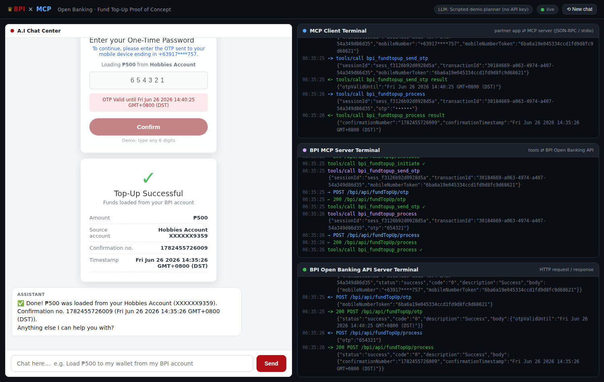

# BPI × MCP — Open Banking Fund Top-Up Proof of Concept

A self-contained proof of concept that **visualises the interactions between an
LLM, an MCP Client, the (proposed) BPI MCP Server, and the BPI Open Banking
API** — all on one screen.

It implements the **Standard Fund Top-Up** journey from the *BPI PARTNER API 2.0
— API Contract v2.1.6*: 3‑Legged OAuth (login → OTP → consent), transactional
account retrieval, and `initiate → otp → process` with a transaction OTP.



## The four screens

The UI is split exactly like the proposed wireframe:

| Panel | What it shows |
|-------|---------------|
| **A.I Chat Center** | A normal AI chat app (powered by Google **Gemini**) that can call tools on an MCP server. The BPI **login**, **login OTP**, **account selection**, and **transaction OTP** screens are simulated *inside* the chat, plus a success receipt. |
| **MCP Client Terminal** | The partner app acting as the **MCP client** — the JSON‑RPC `tools/call` requests and results exchanged with the BPI MCP Server over stdio. |
| **BPI MCP Server Terminal** | The **BPI MCP Server** receiving tool calls and translating them into authenticated HTTP calls to the Open Banking API. |
| **BPI Open Banking API Server Terminal** | The actual simulated **HTTP request/response** traffic for every Open Banking endpoint, shaped per the API contract. |

## Architecture

```
Browser (4 panels) ──WebSocket──┐
                                │
  ┌─────────────────────────────▼──────────────────────────────┐
  │ Orchestrator  (server/orchestrator.js, :3000)               │
  │   • A.I Chat Center  ← Gemini LLM agent loop                │
  │   • MCP CLIENT  ──stdio JSON-RPC──►  BPI MCP Server (child) │
  │   • human-in-the-loop bridge (login / OTP / account / OTP)  │
  └───────────────┬─────────────────────────────────────────────┘
                  │ stdio (stdout=JSON-RPC, stderr=logs)
  ┌───────────────▼─────────────────────────────┐
  │ BPI MCP SERVER  (server/bpi-mcp-server.js)   │  real @modelcontextprotocol/sdk server
  │   tools: bpi_exchange_token,                 │  keeps OAuth tokens server-side
  │          bpi_list_transactional_accounts,    │
  │          bpi_fundtopup_{initiate,send_otp,   │
  │                         process,status}      │
  └───────────────┬──────────────────────────────┘
                  │ HTTPS (Bearer + X-IBM-Client-Id/Secret)
  ┌───────────────▼──────────────────────────────┐
  │ Mock BPI Open Banking API (server/bpi-api.js, :4000)         │
  │   /bpi/api/oauth2/{authorize,login,login/otp,token}          │
  │   /bpi/api/accounts/transactionalAccounts                    │
  │   /bpi/api/fundTopUp/{initiate,otp,process,status}           │
  └──────────────────────────────────────────────┘
```

* The **MCP Client** and **MCP Server** speak the real Model Context Protocol
  (`@modelcontextprotocol/sdk`) over stdio. The server runs as a separate child
  process — genuinely separate components, not a mock.
* OAuth **front‑channel** steps (the login/OTP pages) are driven by the chat UI,
  matching how 3‑Legged OAuth keeps credentials away from the partner app. The
  **back‑channel** `code → token` exchange and all transactional calls go
  *through MCP*.
* The Open Banking API is a faithful **mock** of the contract responses — no
  real BPI systems are contacted.

## Quick start

```bash
# 1. Install dependencies
npm install

# 2. Configure (optional but recommended)
cp .env.example .env
#    then edit .env and paste your Gemini API key (see below)

# 3. Run
npm start

# 4. Open the UI
open http://localhost:3000
```

Then type, for example:

> **Load ₱500 to my wallet from my BPI account**

…and watch the LLM connect via OAuth, list your accounts, and complete the
top-up while every component narrates itself in its own terminal.

## Where do I put the Gemini API key?

1. Get a key from **https://aistudio.google.com/apikey**.
2. Copy the template: `cp .env.example .env`
3. Open **`.env`** and set:

   ```ini
   GEMINI_API_KEY=your_key_here
   # optional:
   GEMINI_MODEL=gemini-2.0-flash
   ```
4. Restart `npm start`. The top bar will show `LLM: Gemini (gemini-2.0-flash)`.

> **No key?** The PoC still runs end‑to‑end using a built‑in **offline scripted
> planner** so you can demo the full journey without any external calls. The top
> bar will say so, and a note appears in the chat. Add a key any time to switch
> to the real model.

`.env` is git‑ignored — your key is never committed.

## Project layout

```
server/
  orchestrator.js     # web server + MCP client + LLM agent loop + WS streaming
  bpi-mcp-server.js   # the BPI MCP Server (stdio child process)
  bpi-api.js          # mock BPI Open Banking API (Express, :4000)
  gemini.js           # Gemini LLM wrapper (@google/genai)
  mock-llm.js         # offline fallback planner (no API key needed)
  agent-tools.js      # LLM-facing tool definitions + system prompt
  logbus.js           # in-process log bus streamed to the terminals
public/
  index.html styles.css app.js   # the four-panel UI + simulated BPI screens
```

## Notes & disclaimers

* This is a **demonstration** only. All accounts, tokens, OTPs, confirmation
  numbers and the BPI API itself are simulated. Any 6 digits are accepted on the
  OTP screens.
* Endpoint paths, headers, scopes and response shapes follow *BPI PARTNER API
  2.0 — API Contract v2.1.6* (Standard Fund Top-Up). JWE/JWT signing and the
  Mobile Key (`/rsa/*`) variant are intentionally out of scope for the PoC.
